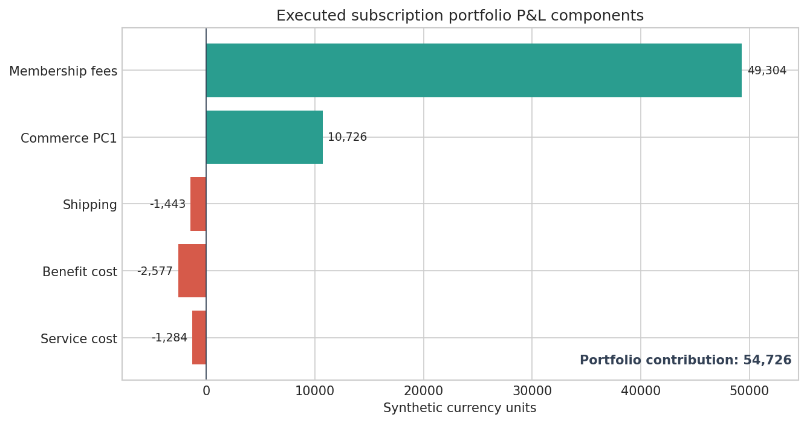
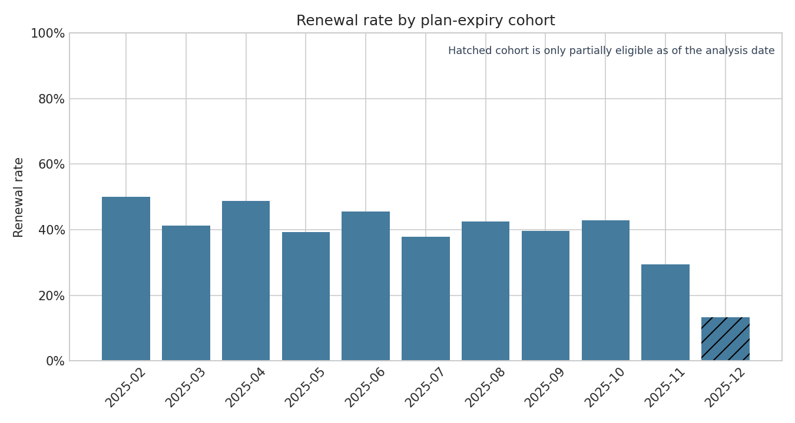
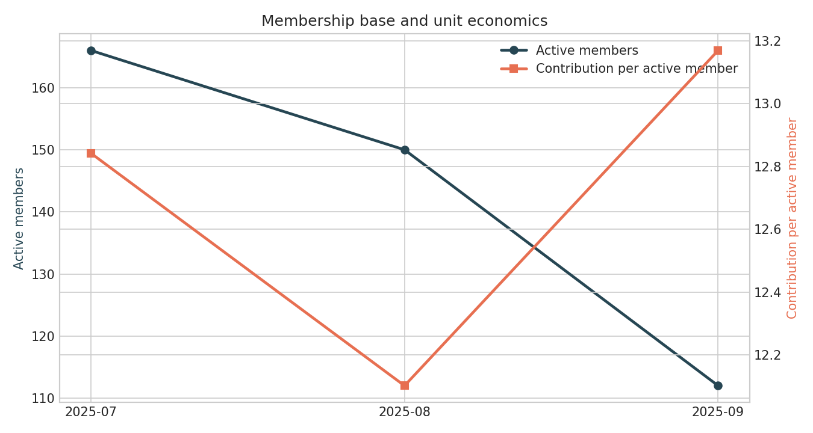
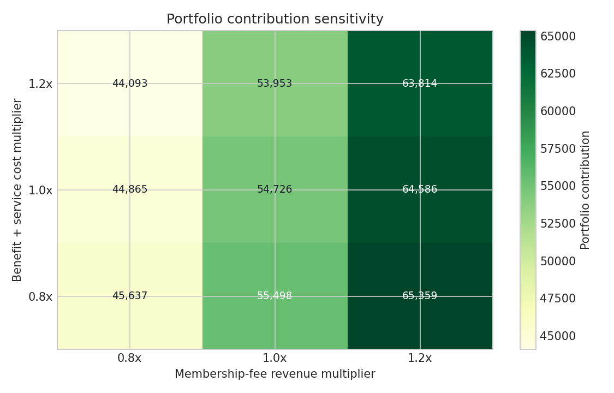

# Subscription Value & Portfolio P&L Analytics

[](https://github.com/parisaMSTFV/subscription-value-pnl-analytics/actions/workflows/ci.yml)

[](DATA_PROVENANCE.md)
[](LICENSE)

This project reconciles subscription fees, commerce margin, benefit costs,
service costs, renewal, and member activity into one auditable operating view.
It accepts documented CSV inputs and produces both detailed audit tables and
aggregate decision evidence.

## Executed decision snapshot

The committed run uses 1,200 simulated customers and seed `42`.

| Measure | Result |
|---|---:|
| Active members | 207 |
| Portfolio contribution | **54,725.69** |
| Contribution excluding membership fees | **5,422.16** |
| Membership-fee share of contribution | **90.1%** |
| Renewal rate across 514 eligible plans | **40.3%** |
| Active-member change, July to September | **-32.5%** |
| Worst configured sensitivity point | **44,092.74** |



The operating signal is mixed: active membership contracts across the period,
while contribution per active member moves from 12.84 to 13.17. The immediate
investigation is therefore the decline in the membership base, not an automatic
price or benefit-cost change.

## Run it

```bash
python -m pip install -e ".[dev]"
make reproduce
make check
```

`make reproduce` regenerates the synthetic inputs, detailed artifacts,
aggregate tables, decision report, and four figures. To verify the external
input contract on a small committed fixture:

```bash
make fixture
```

## Decisions supported

The pipeline answers four separate operating questions:

1. How do membership fees and direct benefit costs reconcile at portfolio level?
2. Which member segments account for the largest operating contribution?
3. What share of fully observable plans renew within the defined grace period?
4. Is a change in portfolio economics driven by member count or unit economics?

This is a descriptive portfolio-performance system. It does not claim that
membership causes the observed order or margin differences.

## P&L boundary

Only activity recorded on active membership days enters the portfolio P&L.
Plan revenue is allocated according to the number of subscription days that
overlap the analysis period.

```text
portfolio contribution =
  allocated membership fee revenue
  + commerce PC1
  + shipping contribution
  - benefit cost
  - service cost
```

The base run produces 54,725.69 in contribution. Membership fees account for
90.1% of that result; the remaining commerce and shipping contribution exceeds
benefit and service cost by 5,422.16.

## Renewal and cohort eligibility

A plan enters renewal measurement only after its end date and complete grace
period are observable. Cohorts are grouped by plan-expiry month. Partially
eligible expiry cohorts are marked explicitly rather than treated as complete.



The executed portfolio renewal rate is 40.3%. This rate is an observed outcome
for the synthetic plans; it is not a churn-model score or a causal treatment
effect.

## Membership base and unit economics



Active members fall from 166 in July to 112 in September. Operating contribution
per active member remains comparatively stable, so aggregate contraction and
per-member economics point in different directions.

## Scenario sensitivity

The sensitivity grid varies realized membership-fee revenue and combined
benefit/service cost from `0.8x` to `1.2x`. Commerce contribution and shipping
contribution remain fixed, making this an assumption stress test rather than a
forecast.



At the least favorable configured point—`0.8x` fee revenue and `1.2x` direct
cost—portfolio contribution remains 44,092.74. The grid does not model member
response to a price or benefit change.

## Use another dataset

Place `activity_daily.csv` and `subscriptions.csv` in one directory, then run:

```bash
subscription-value analyze \
  --data-dir path/to/input \
  --output-dir path/to/detailed-artifacts \
  --reports-dir path/to/aggregate-reports \
  --start 2025-07-01 \
  --end 2025-10-01 \
  --as-of 2026-01-01
```

The [input contract](docs/INPUT_SCHEMA.md) defines grain, types, units, temporal
boundaries, and renewal censoring. The committed `data/fixture/` files exercise
this path in CI.

## Output map

| Output | Purpose |
|---|---|
| `artifacts/customer_period.csv` | Customer-level audit table |
| `artifacts/renewal_detail.csv` | Plan-level renewal eligibility and outcome |
| `reports/portfolio_pnl.csv` | Period P&L reconciliation |
| `reports/renewal_summary.csv` | Eligible plans, renewed plans, and renewal rate |
| `reports/renewal_cohorts.csv` | Expiry-cohort renewal with completeness flag |
| `reports/monthly_member_trend.csv` | Member count and unit-economics trend |
| `reports/pnl_sensitivity.csv` | Fee and direct-cost stress grid |
| `reports/metrics.json` | Machine-readable decision metrics |
| `reports/decision_report.md` | Short operating interpretation |

Row-level generated inputs and detailed artifacts remain outside version
control. Aggregate executed evidence is committed.

## Quality controls

Tests cover:

- unique customer-day and subscription identifiers;
- period boundaries and active-membership filtering;
- plan-day revenue allocation;
- complete renewal-window eligibility;
- customer-to-segment reconciliation;
- P&L component reconciliation;
- sensitivity-grid arithmetic;
- aggregate report and figure generation.

GitHub Actions runs linting, formatting, tests, the external-input fixture,
aggregate-output reproduction, and the sensitive-content scan on Python 3.10,
3.11, and 3.12.

## Repository structure

```text
src/subscription_value/   analysis, renewal, P&L, sensitivity, and reporting
data/fixture/             compact input-contract fixture
tests/                    metric, reconciliation, contract, and pipeline tests
reports/                  committed aggregate evidence and figures
docs/                     input schema, case design, and metric definitions
sql/                      warehouse extraction contract
scripts/                  sensitive-content check
```

## Limitations

- All committed results come from a deterministic synthetic generator.
- Observed member and non-member outcomes are not an estimate of incremental
  subscription impact.
- Renewal is defined at plan level and depends on the configured grace period.
- The fee/cost grid is a static stress test and does not estimate behavioral
  response, demand elasticity, or treatment effects.
- Segment contribution is descriptive and should not determine individual
  eligibility or contact policy.
- Production use requires governed source contracts, finance reconciliation,
  tax and refund rules, data-quality monitoring, and controlled measurement of
  incremental member value.

## Documentation

- [Decision report](reports/decision_report.md)
- [Input contract](docs/INPUT_SCHEMA.md)
- [Case-study design](docs/CASE_STUDY.md)
- [Metric definitions](docs/METRICS.md)
- [Data provenance](DATA_PROVENANCE.md)

## License

MIT
